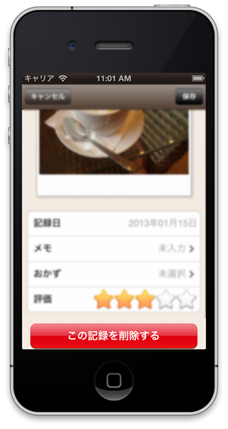

About
------
This is the button with a confirmation in the widget of Titanium Alloy.

 

Usage
------
Copy the `widgets` folder in `app/widgets` folder of your project.

### View ###
#### app/views/index.xml ####
```xml
<Alloy>
  <Window>
    <Widget src="jp.co.mountposition.alertbutton" title="Delete" onDispose="doDispose" />
  </Window>
</Alloy>
```

### Controller ###
#### app/controllers/index.js ####
```javascript
function doDispose() {
  // Do button click action.
}
```

### I18n ###
#### i18n/ja/strings.xml ####
Wording of the cancellation is compatible with I18n.

```xml
<?xml version="1.0" encoding="UTF-8"?>
<!-- i18n/ja/strings.xml -->
<resources>
  <string name="cancel">キャンセル</string>
</resources>
```


License
----------
Written by [@hamasyou](https://twitter.com/hamasyou/)
Copyright &copy; 2013 MountPosition Inc.
Licensed under the [MIT License][MIT]
[MIT]: http://www.opensource.org/licenses/mit-license.php
